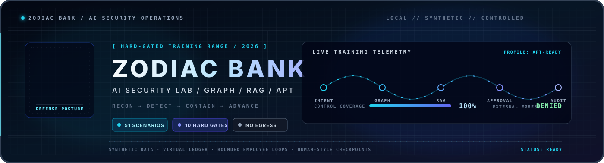

<div align="center">

<a href="https://github.com/youseefhamdi/AI-Security-Lab">
  
</a>

[](#-zodiac-brand)
[](https://docs.docker.com/compose/)
[](https://huggingface.co/prism-ml/bonsai-27b)
[](https://github.com/ggml-org/llama.cpp)
[](#-security-boundary)

> **ZODIAC AI Security Lab** — an isolated environment for model fingerprinting, prompt injection, RAG attacks, agent protocol abuse, memory poisoning, supply-chain scenarios, and SIEM detection.

</div>

---

## 📚 Contents

- [What this project is](#-what-this-project-is)
- [ZODIAC brand](#-zodiac-brand)
- [Choose a runtime profile](#-choose-a-runtime-profile)
- [Requirements](#-requirements)
- [Install on any platform](#-install-on-any-platform)
- [Podman setup](#-podman-setup)
- [Prepare an inference provider](#-prepare-an-inference-provider)
- [Start the lab](#-start-the-lab)
- [Verify the lab](#-verify-the-lab)
- [Run the training exercises](#-run-the-training-exercises)
- [Automatic provider detection](#-automatic-provider-detection)
- [Endpoints](#-endpoints)
- [Stop, restart, and clean](#-stop-restart-and-clean)
- [Troubleshooting](#-troubleshooting)
- [VPS build-only policy](#-vps-build-only-policy)
- [Security boundary](#-security-boundary)
- [Authoritative upstreams](#-authoritative-upstreams)

## ✨ What this project is

**ZODIAC AI Security Lab** is a local-first training environment based on OffSec AI-300 Module 2 concepts. It combines vulnerable AI applications, agent protocols, retrieval systems, memory services, an API gateway, and detection tooling into one reproducible lab.

The project is intentionally unsafe by design. It includes debug leaks, exposed tool schemas, synthetic credentials, prompt-injection weaknesses, unauthenticated protocol exercises, and honeypot data. Run it only on a machine you control and keep all services bound to localhost.

## ⚔️ ZODIAC brand

When the lab is launched through the startup helper, it displays an animated **ZODIAC Spartan** activation banner before starting services:

```bash
RUNTIME=1 ./scripts/start_all.sh
```

The README hero uses a generic animated AI Security Lab banner. The ZODIAC name is reserved for the runtime identity and terminal startup experience.

## 🧭 Architecture

```text
┌──────────────────────────────────────────────────────────────────────┐
│                      ZODIAC AI SECURITY LAB                          │
├──────────────────────────────────────────────────────────────────────┤
│  CORE                                                               │
│  Bonsai 27B / llama.cpp → Aurora · Phoenix · Assistant              │
│  Local Markdown retrieval                                            │
├──────────────────────────────────────────────────────────────────────┤
│  PROTOCOLS                    DATA + MEMORY                          │
│  A2A Router · Knowledge Agent  ChromaDB · Milvus · LightRAG · Mem0   │
│  MCP Server · MCP Wrapper      Optional full-profile services        │
├──────────────────────────────────────────────────────────────────────┤
│  CONTROL + VISIBILITY                                               │
│  Kong API Gateway · Elasticsearch · Kibana · Filebeat                │
│  Agent Orchestrator · Loop Engineering · Understand-Anything        │
└──────────────────────────────────────────────────────────────────────┘
```

## ⚡ Choose a runtime profile

Start with **core**. Add protocols or the full stack only when you need them.

| Profile | Services | Typical resources | Start command |
| --- | --- | --- | --- |
| `core` | Bonsai or detected provider, Aurora, Phoenix, Assistant | 8 GB RAM minimum; 10–12 GB recommended | `RUNTIME=1 ./scripts/start_all.sh` |
| `lite` | Core + A2A Router, Knowledge Agent, MCP server, MCP wrapper | 10 GB minimum; 12–16 GB recommended | `RUNTIME=1 LAB_MODE=lite ./scripts/start_all.sh` |
| `full` | Lite + Kong, storage, Mem0, LightRAG, extra MCP, ELK | 32 GB minimum; 48 GB recommended | `RUNTIME=1 LAB_MODE=full SEED_DATA=0 ./scripts/start_all.sh` |

### Core profile

Starts four application containers and one inference container only when a local Bonsai fallback is selected:

- Bonsai llama.cpp, if no external provider is available
- Aurora support chatbot
- Phoenix code reviewer
- Assistant OpenAI-compatible API
- Dependency-free local Markdown retrieval

### Lite profile

Adds protocol reconnaissance targets:

- A2A Router
- A2A Knowledge Agent
- MCP server
- MCP wrapper

### Full profile

Adds infrastructure and detection services:

- Kong and PostgreSQL
- ChromaDB, Milvus, Redis, LightRAG, Mem0
- MCP memory, filesystem, and fetch services
- Elasticsearch, Kibana, and Filebeat

> **Important:** full mode requires an embedding provider for LightRAG/Mem0. Bonsai is a text-generation backend and does not provide embeddings.

## 💻 Requirements

### All platforms

- Docker Engine or Docker Desktop
- Docker Compose v2
- Git
- `curl`
- 64-bit operating system
- Internet access for Docker images and application builds
- A pre-downloaded model from one supported provider, or the local Bonsai GGUF

### Recommended resources

| Profile | CPU | RAM | Disk |
| --- | ---: | ---: | ---: |
| Core | 4 cores | 8 GB minimum / 10–12 GB recommended | 15 GB minimum / 25 GB recommended |
| Lite | 4 cores | 10 GB minimum / 12–16 GB recommended | 20 GB minimum / 30 GB recommended |
| Full | 12+ cores | 32 GB minimum / 48 GB recommended | 100 GB minimum |

Bonsai defaults to a 2K context, one concurrent request, CPU mode, and a 5 GB container memory limit. Increase `BONSAI_CONTEXT_SIZE` only when the host has additional memory.

## 📥 Install on any platform

### Linux

```bash
git clone https://github.com/youseefhamdi/AI-Security-Lab.git
cd AI-Security-Lab

docker --version
docker compose version
```

If the scripts are not executable after transfer:

```bash
chmod +x scripts/*.sh exercises/*.sh
```

### Podman setup

This lab also works with Podman when `docker` and `docker compose` are Docker-compatible wrappers. Confirm the versions:

```bash
docker --version
docker compose version
```

If the output says `Emulate Docker CLI using podman`, that is acceptable. Continue using the repository's `docker compose` commands; do not mix separate `podman-compose` commands for the same project.

From the cloned repository:

```bash
pwd
find models -maxdepth 1 -type f -printf '%f\t%k KB\n'
docker compose config >/tmp/zodiac-compose.yml
```

If the Bonsai model is outside the repository, the lab automatically searches common LM Studio directories under your home directory. Try the model check first:

```bash
./scripts/pull_models.sh
```

For a custom model directory, set an absolute path in `.env`:

```bash
printf 'BONSAI_MODEL_DIR=%s\n' "$HOME/path/to/model-directory" > .env
```

The lab recursively discovers the `.gguf` file in that directory. Do not leave the placeholder `your-actual-file.gguf` in `.env`.

Check the model without downloading anything:

```bash
./scripts/pull_models.sh
```

For Ollama, LM Studio, or another provider running on the host, Podman normally exposes the host as `host.containers.internal`. Set this only when using an external provider:

```bash
export INFERENCE_CONTAINER_HOST=host.containers.internal
```

The local Bonsai fallback does not require this setting.

### macOS

1. Install [Docker Desktop](https://www.docker.com/products/docker-desktop/).
2. Open Docker Desktop and wait until it reports that Docker is running.
3. Clone the repository:

```bash
git clone https://github.com/youseefhamdi/AI-Security-Lab.git
cd AI-Security-Lab
```

4. Verify Docker:

```bash
docker --version
docker compose version
```

### Windows

Use either **PowerShell with Docker Desktop**, **Git Bash**, or **WSL2**.

1. Install [Docker Desktop](https://www.docker.com/products/docker-desktop/) with the WSL2 backend enabled.
2. Start Docker Desktop.
3. Clone the repository in Git Bash or WSL2:

```bash
git clone https://github.com/youseefhamdi/AI-Security-Lab.git
cd AI-Security-Lab
```

4. Verify Docker:

```bash
docker --version
docker compose version
```

If Bash scripts do not run directly, invoke them explicitly:

```bash
bash scripts/start_all.sh
```

Docker Desktop normally provides `host.docker.internal`, allowing containers to reach Ollama or LM Studio running on Windows or macOS.

## 🌳 Prepare an inference provider

The lab never pulls models. It automatically detects an already-running provider.

Supported providers:

| Provider | Default endpoint | Model listing endpoint |
| --- | --- | --- |
| Ollama | `http://127.0.0.1:11434` | `/api/tags` |
| LM Studio / LMS | `http://127.0.0.1:1234/v1` | `/models` |
| Existing llama.cpp/Bonsai | `http://127.0.0.1:11435/v1` | `/models` |
| Local Bonsai fallback | `./models/*.gguf` | File existence check |

### Option A: Use Ollama

1. Start Ollama on the host.
2. Make sure at least one chat model is already available.
3. Confirm it responds:

```bash
curl http://127.0.0.1:11434/api/tags
```

If the provider runs outside Docker on Linux, it must listen on an address reachable from Docker. Configure Ollama according to your host installation; do not expose it beyond your trusted local network.

### Option B: Use LM Studio

1. Start LM Studio.
2. Download or import a model in LM Studio yourself.
3. Start its local server on port `1234`.
4. Confirm the OpenAI-compatible endpoint:

```bash
curl http://127.0.0.1:1234/v1/models
```

### Option C: Use the local Bonsai GGUF

Place the already-downloaded file under `models/`:

```text
models/bonsai-27b.gguf
```

If its filename is different, create a local `.env` file:

```env
BONSAI_MODEL_FILE=your-actual-bonsai-file.gguf
```

If the model is stored outside the repository—for example in your LM Studio hub—try the standard home-directory locations first:

```bash
./scripts/pull_models.sh
```

The default search includes:

```text
./models
$HOME/.lmstudio/hub/models
$HOME/.lmstudio/models
$HOME/.cache/lm-studio/models
$HOME/.cache/lmstudio/models
```

For a non-standard location, configure it explicitly:

```bash
printf 'BONSAI_MODEL_DIR=%s\n' "$HOME/path/to/model-directory" > .env
./scripts/pull_models.sh
```

This uses the existing model and never copies or downloads it. Ensure the user running Podman can read the directory. If LM Studio’s local server is running instead, use provider detection and do not configure `BONSAI_MODEL_DIR`:

```bash
curl http://127.0.0.1:1234/v1/models
RUNTIME=1 LAB_MODE=core ./scripts/start_all.sh
```

Verify the fallback file without downloading anything:

```bash
./scripts/pull_models.sh
```

## 🚀 Start the lab

### Recommended first run

From the repository root, run these commands in order. If `.env` contains `BONSAI_MODEL_DIR`, the local Bonsai model takes precedence over a running Ollama server:

```bash
cd /path/to/AI-Security-Lab  # replace with your clone path
chmod +x scripts/*.sh exercises/*.sh
docker compose config >/tmp/zodiac-compose.yml
./scripts/pull_models.sh
RUNTIME=1 LAB_MODE=core ./scripts/start_all.sh
```

The model check is local-only and never performs a model pull. The startup helper may download/build container images on the first run.

### 1. Start the smallest core

Use the branded helper so the ZODIAC Spartan activation appears in the terminal:

```bash
RUNTIME=1 ./scripts/start_all.sh
```

The helper will:

1. Display the ZODIAC startup banner.
2. Prefer a configured `BONSAI_MODEL_DIR` and use the local Bonsai GGUF.
3. Otherwise detect Ollama, LM Studio, or an existing llama.cpp provider.
4. Select the first available external model when no local Bonsai directory is configured.
5. Start Aurora, Phoenix, and Assistant with the selected backend.

Check the result:

```bash
docker compose ps
curl --fail http://127.0.0.1:5000/health
curl --fail http://127.0.0.1:5001/api/health
curl --fail http://127.0.0.1:5002/health
RUNTIME=1 ./scripts/test_inference.sh
```

If startup fails, inspect the relevant service:

```bash
docker compose logs --tail=100 bonsai
docker compose logs --tail=100 aurora
```

### 2. Start protocol services

```bash
RUNTIME=1 LAB_MODE=lite ./scripts/start_all.sh
```

### 3. Start the complete lab

First start the full stack without seeding:

```bash
RUNTIME=1 LAB_MODE=full SEED_DATA=0 ./scripts/start_all.sh
```

Only enable seeding after ChromaDB, Milvus, LightRAG, Mem0, and the required embedding provider are configured:

```bash
RUNTIME=1 LAB_MODE=full SEED_DATA=1 ./scripts/start_all.sh
```

### Direct Compose startup

Direct Compose startup uses the local Bonsai fallback values and bypasses provider detection and the terminal brand animation:

```bash
docker compose up -d
```

The provider-aware startup path is recommended.

## 🔎 Automatic provider detection

The detection helper is:

```text
scripts/detect_provider.sh
```

It exports these values for Compose:

```text
INFERENCE_PROVIDER
INFERENCE_BASE_URL
INFERENCE_LOCAL_BASE_URL
INFERENCE_MODEL
```

The applications all use one OpenAI-compatible interface, regardless of which provider was selected.

Override selection when needed:

```bash
INFERENCE_PROVIDER=ollama \
INFERENCE_MODEL=llama3.2:1b \
RUNTIME=1 ./scripts/start_all.sh
```

```bash
INFERENCE_PROVIDER=lmstudio \
INFERENCE_MODEL=your-lm-studio-model \
RUNTIME=1 LAB_MODE=lite ./scripts/start_all.sh
```

```bash
INFERENCE_PROVIDER=bonsai \
RUNTIME=1 ./scripts/start_all.sh
```

For another OpenAI-compatible server:

```bash
INFERENCE_DISCOVERY_URL=http://127.0.0.1:8000/v1 \
INFERENCE_CONTAINER_URL=http://host.docker.internal:8000/v1 \
RUNTIME=1 ./scripts/start_all.sh
```

## ✅ Verify the lab

### Check containers

```bash
docker compose ps
```

For full mode:

```bash
docker compose --profile protocols --profile full ps
```

### Check core health endpoints

```bash
curl --fail http://127.0.0.1:5000/health
curl --fail http://127.0.0.1:5001/api/health
curl --fail http://127.0.0.1:5002/health
```

If the local Bonsai container is selected:

```bash
curl --fail http://127.0.0.1:11435/health
```

If Ollama or LM Studio was selected, check that provider’s host endpoint instead.

### Run the inference smoke test

```bash
RUNTIME=1 ./scripts/test_inference.sh
```

The test automatically detects the provider, sends `Reply: BACKEND_OK`, and validates the OpenAI-compatible response shape.

### Test the application APIs

Aurora:

```bash
curl -sS http://127.0.0.1:5000/api/chat \
  -H 'Content-Type: application/json' \
  -d '{"query":"How many PTO days does a first-year employee receive?","session_id":"demo"}'
```

Phoenix:

```bash
curl -sS http://127.0.0.1:5001/api/review \
  -H 'Content-Type: application/json' \
  -d '{"language":"python","code":"password = input()\nprint(password)"}'
```

Assistant:

```bash
curl -sS http://127.0.0.1:5002/v1/chat/completions \
  -H 'Content-Type: application/json' \
  -d '{"model":"auto","messages":[{"role":"user","content":"Reply: ASSISTANT_OK"}]}'
```

## 🧪 Run the training exercises

All exercises are for authorized local use only. Runtime exercises are guarded by `RUNTIME=1`.

```bash
# Model fingerprinting
RUNTIME=1 ./scripts/test_inference.sh

# A2A and MCP reconnaissance
RUNTIME=1 ./exercises/protocol_recon.sh

# Aurora, Phoenix, and Assistant attack exercises
RUNTIME=1 ./exercises/app_attacks.sh

# Mem0 poisoning and extraction exercises
RUNTIME=1 ./exercises/mem0_attacks.sh

# Storage backend reconnaissance (requires full-mode vector settings)
RUNTIME=1 CHROMA_COLLECTION_ID=... QUERY_EMBEDDING_JSON='...' ./scripts/storage_recon.sh

# Noisy versus stealthy detection practice
RUNTIME=1 ./exercises/evasion_practice.sh
```

The written exercises and attack notes are available in:

```text
exercises/
docs/
```

## 🔌 Endpoints

### Core services

| Service | Endpoint |
| --- | --- |
| Selected inference provider | Host-specific; see startup output |
| Local Bonsai fallback | `http://127.0.0.1:11435` |
| Aurora | `http://127.0.0.1:5000` |
| Phoenix | `http://127.0.0.1:5001` |
| Assistant | `http://127.0.0.1:5002` |

### Protocol services — `lite` / `full`

| Service | Endpoint |
| --- | --- |
| MCP server | `http://127.0.0.1:3000` |
| MCP wrapper | `http://127.0.0.1:3001` |
| A2A Knowledge Agent | `http://127.0.0.1:5011` |
| A2A Router | `http://127.0.0.1:5010` |
| Legacy A2A agent | `http://127.0.0.1:4000` |
| MCP filesystem | `http://127.0.0.1:3002` |
| MCP fetch | `http://127.0.0.1:3003` |
| MCP memory | `http://127.0.0.1:3004` |

### Full data, gateway, and SIEM services

| Service | Endpoint |
| --- | --- |
| Kong proxy | `http://127.0.0.1:8000` |
| Kong Admin API | `http://127.0.0.1:8001` |
| ChromaDB | `http://127.0.0.1:8010` |
| Mem0 REST API | `http://127.0.0.1:8888` |
| Elasticsearch | `http://127.0.0.1:9200` |
| Milvus | `http://127.0.0.1:19530` |
| LightRAG | `http://127.0.0.1:9621` |
| Redis | `http://127.0.0.1:6379` |
| Kibana | `http://127.0.0.1:5601` |

## 🧱 Project map

```text
apps/                  Aurora, Phoenix, and Assistant
mcp-server/            Deliberately vulnerable MCP server
mcp-wrapper/           HTTP wrapper for MCP tools
a2a-agents/            A2A Router and Knowledge Agent
rag-docs/              Synthetic NovaTech knowledge corpus
sensitive-data/        Honeypot credentials and internal fixtures
exercises/             Recon, attack, evasion, and fingerprint exercises
scripts/               Startup, seeding, detection, and verification helpers
docs/                  Security notes and attack-surface guides
orchestrator-config/   Agent Orchestrator project manifest
mem0-config/           Optional Mem0 configuration
models/                Local GGUF files; ignored by Git
```

## 🛑 Stop, restart, and clean

### Stop services

```bash
RUNTIME=1 ./scripts/stop_all.sh
```

### Restart the current profile

```bash
RUNTIME=1 ./scripts/start_all.sh
```

Use the same `LAB_MODE` and provider variables used for the original launch.

### Remove containers and networks

```bash
RUNTIME=1 ./scripts/stop_all.sh
```

### Remove containers, networks, and volumes

> This permanently deletes local lab data, including indexed documents, memory records, and SIEM data.

```bash
RUNTIME=1 CONFIRM_CLEAN=1 ./scripts/clean_all.sh
```

The cleanup script never deletes model files under `models/`.

## 🧯 Troubleshooting

### `Missing Bonsai GGUF`

Either start Ollama/LM Studio first, or place a GGUF file under `models/` and set:

```env
BONSAI_MODEL_FILE=your-file.gguf
```

### Provider was not detected

Check the provider directly:

```bash
curl http://127.0.0.1:11434/api/tags
curl http://127.0.0.1:1234/v1/models
curl http://127.0.0.1:11435/v1/models
```

Then select the provider explicitly with `INFERENCE_PROVIDER`.

### Containers cannot reach a host provider

Docker commonly uses `host.docker.internal`; Podman commonly uses `host.containers.internal`. For Podman with Ollama, LM Studio, or host llama.cpp, set:

```bash
export INFERENCE_CONTAINER_HOST=host.containers.internal
RUNTIME=1 LAB_MODE=core ./scripts/start_all.sh
```

For Docker, omit the override. Confirm that the provider is reachable on the host first:

```bash
curl http://127.0.0.1:11434/api/tags
curl http://127.0.0.1:1234/v1/models
```

The local Bonsai fallback uses the Compose service network and does not need a host-provider hostname. Confirm that the provider listens on an address reachable from the container runtime and that the host firewall allows local container traffic.

### Model name is wrong

Set the exact provider model identifier:

```bash
INFERENCE_PROVIDER=lmstudio INFERENCE_MODEL=exact-model-id RUNTIME=1 ./scripts/start_all.sh
```

### A port is already in use

Find the process using the port and stop it, or change the host port in `docker-compose.yml`. Core ports are `11435`, `5000`, `5001`, and `5002`; full mode adds the ports listed in the endpoint tables.

### A service is unhealthy

Inspect logs without starting anything new:

```bash
docker compose logs --tail=100 bonsai
docker compose logs --tail=100 aurora
```

For full mode:

```bash
docker compose --profile protocols --profile full logs --tail=100
```

### Docker Desktop runs out of memory

Use core mode, reduce `BONSAI_CONTEXT_SIZE`, close other containers, or increase Docker Desktop memory. Do not start full mode on a small machine.

### Mem0 or LightRAG fails in full mode

Full mode needs an embedding provider. Bonsai only generates text. Configure the embedding variables in `.env` and review `mem0-config/config.yaml` before enabling storage seeding.

## 🛡️ VPS build-only policy

The VPS is for building and static verification only:

- Do **not** run `docker compose up` or `docker run` on the VPS.
- Do **not** pull models.
- Do **not** install OS packages.
- Do **not** contact runtime services.
- Use `bash -n`, `py_compile`, file checks, and `docker compose config` only.
- Transfer the repository and model file to the local machine before execution.

## ⚠️ Mem0 and embedding caveat

The official `mem0/mem0-api-server` image is optional and authenticated by default. Its stock REST image does not bundle every provider needed for a fully local Bonsai-plus-embeddings deployment. The core and lite modes do not start Mem0. Full mode requires a locally customized Mem0 image and a compatible embedding provider for LightRAG/Mem0.

## 🔗 Authoritative upstreams

- [Agent Orchestrator](https://github.com/Untrivial-ai/agent-orchestrator)
- [Mem0](https://github.com/mem0ai/mem0)
- [Loop Engineering](https://github.com/cobusgreyling/loop-engineering)
- [Milvus](https://github.com/milvus-io/milvus)
- [LightRAG](https://github.com/HKUDS/LightRAG)
- [llama.cpp](https://github.com/ggml-org/llama.cpp)

## 🔐 Security boundary

This project is for **authorized local training only**. It intentionally contains:

- Vulnerable debug and metadata endpoints
- Synthetic credentials and honeypot secrets
- Unauthenticated protocol exercises
- Prompt-injection and guardrail weaknesses
- Memory and retrieval attack fixtures

Never expose the lab to the public internet, reuse its credentials, place real secrets in `sensitive-data/`, or commit model weights.

<div align="center">

### ZODIAC // Built for controlled AI security research

`Recon → Exploit → Detect → Harden`

</div>
