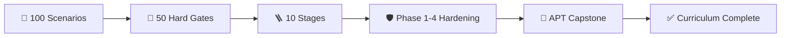
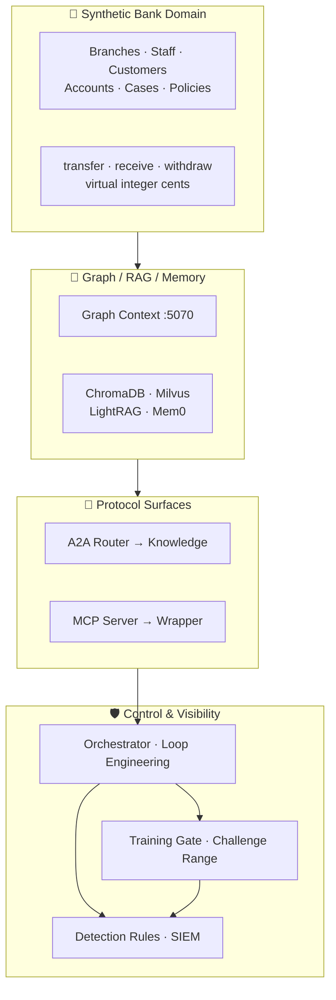
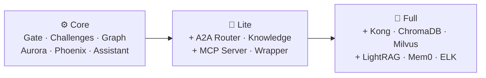
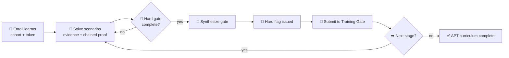
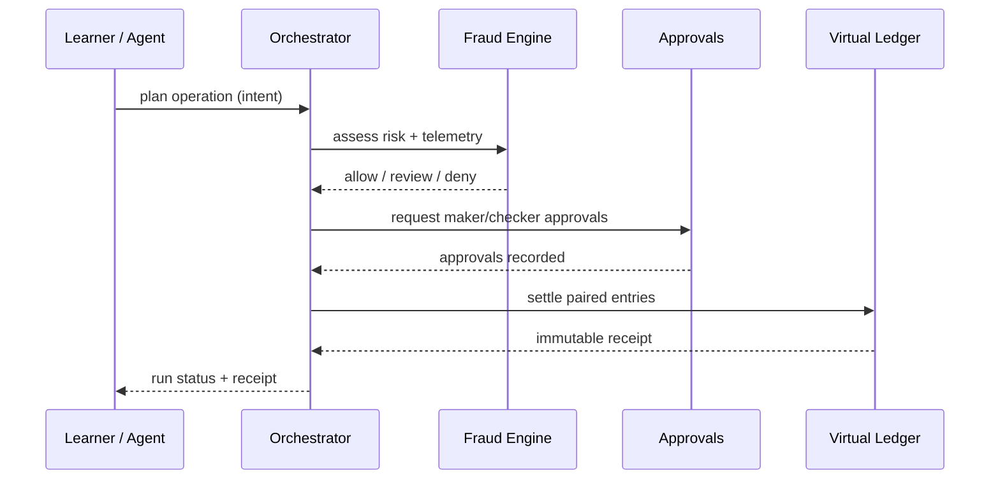
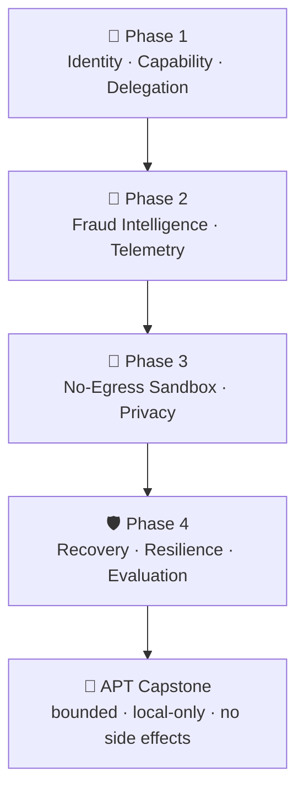
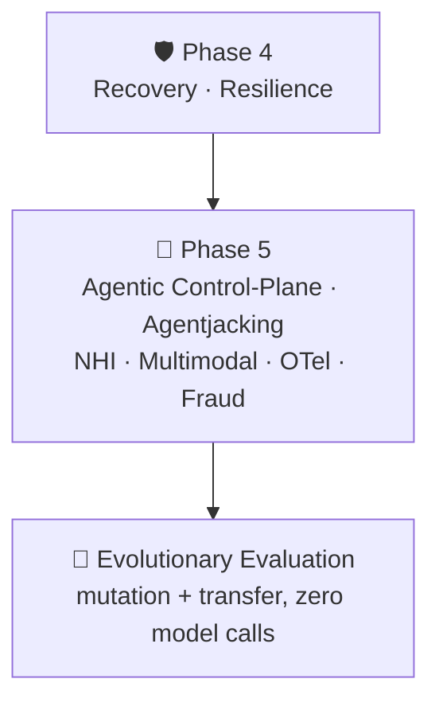
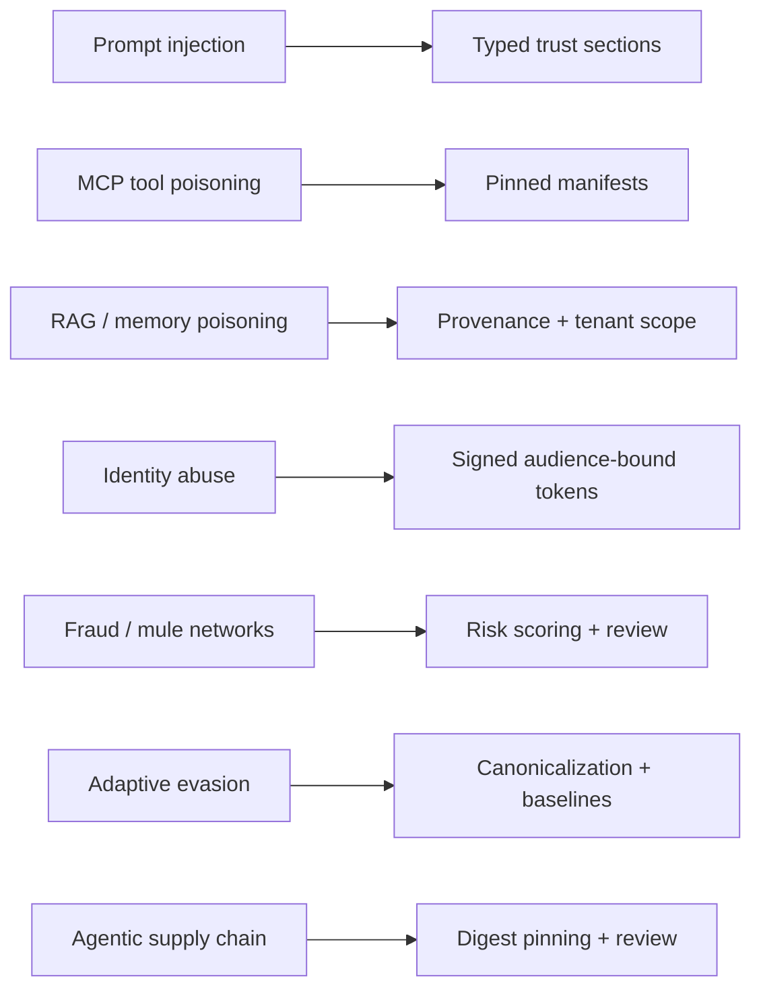
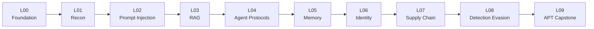

<div align="center">

<a href="https://github.com/youseefhamdi/AI-Security-Lab">
  
</a>

[](#-zodiac-bank-brand)
[](https://docs.docker.com/compose/)
[](https://huggingface.co/prism-ml/bonsai-27b)
[](https://github.com/ggml-org/llama.cpp)
[](#-security-boundary)
[](#-zodiac-bank-progression)
[](#-security-boundary)
[](LICENSE)

> **Zodiac Bank AI Security Lab** — a hands-on, step-by-step AI security training lab that takes students from absolute scratch to advanced, APT-level skills through a synthetic banking environment covering prompt injection, RAG and memory poisoning, MCP/A2A abuse, agentic supply-chain risk, and SIEM detection.

</div>

---

## 📚 Contents

- [What this project is](#-what-this-project-is)
- [About Zodiac Bank](#-about-zodiac-bank-ai-security-lab)
- [ZODIAC BANK brand](#-zodiac-bank-brand)
- [Choose a runtime profile](#-choose-a-runtime-profile)
- [Requirements](#-requirements)
- [Install on any platform](#-install-on-any-platform)
- [Podman setup](#podman-setup)
- [Prepare an inference provider](#-prepare-an-inference-provider)
- [Start the lab](#-start-the-lab)
- [Verify the lab](#-verify-the-lab)
- [Run the training exercises](#-run-the-training-exercises)
- [Zodiac Bank progression](#-zodiac-bank-progression)
- [Graph and context engineering](#-graph-and-context-engineering)
- [Phase 1 agent identity and capability security](#-phase-1-agent-identity-and-capability-security)
- [Phases 2–4 security controls](#-phases-24-security-controls)
- [Phase 5 agentic-2026 control range](#-phase-5-agentic-2026-control-range)
- [AI threat curriculum and APT range](#-ai-threat-curriculum-and-apt-range)
- [Hard scenario range](#-hard-scenario-range)
- [Security audit status](#-security-audit-status)
- [Automatic provider detection](#-automatic-provider-detection)
- [Endpoints](#-endpoints)
- [Stop, restart, and clean](#-stop-restart-and-clean)
- [Troubleshooting](#-troubleshooting)
- [VPS build-only policy](#-vps-build-only-policy)
- [Security boundary](#-security-boundary)
- [Authoritative upstreams](#-authoritative-upstreams)
- [License](#-license)

## ✨ What this project is

**Zodiac Bank AI Security Lab** is a local-first, hands-on **training lab** for AI security — built for students, instructors, and defenders who want to learn the full attacker→defender path from the very beginning up to advanced, APT-level techniques. It is a learning environment, not a research project: every concept is taught as a progressive, gated lesson with a flag to earn and a next stage to unlock.

It is based on OffSec AI-300 Module 2 concepts and combines vulnerable AI applications, agent protocols, retrieval systems, memory services, an API gateway, progression gates, and detection tooling into one reproducible lab. Learners start with reconnaissance and simple prompt injection, then advance through RAG and memory poisoning, agent identity abuse, MCP/A2A tool attacks, supply-chain compromise, detection evasion, and APT-level containment.

The project is intentionally unsafe by design inside its challenge surfaces. It includes debug leaks, exposed tool schemas, synthetic credentials, prompt-injection weaknesses, unauthenticated protocol exercises, and honeypot data. The surrounding progression, graph/context, and workflow controls are bounded and authenticated where configured. Run it only on a machine you control and keep all services bound to localhost.

## 🏦 About Zodiac Bank AI Security Lab

**Zodiac Bank AI Security Lab** is a local-first, hands-on training lab that takes AI security students from absolute scratch to advanced APT-level defense. It teaches complete socio-technical workflows — not just chat interfaces — by combining realistic synthetic banking operations with a hard-gated curriculum that moves from reconnaissance and prompt injection to RAG and memory poisoning, agent identity abuse, MCP/A2A tool attacks, supply-chain compromise, detection evasion, and APT-level containment.

The lab models a complete training environment: branches, employees, staff roles, customers, virtual accounts, transfers, deposits, withdrawals, receipts, approval checkpoints, graph relationships, RAG evidence, memory records, and bounded employee-loop workflows. A learner’s accepted flag dynamically promotes the bank’s defensive posture, narrows data scope, changes agent budgets and approval requirements, and unlocks the next security tier.

### What makes it different

- **Progressive by design:** 10 hard-gated stages, 50 sequential hard gates, and 100 multi-step scenarios require evidence discovery before advancement.
- **System-level AI security:** prompt injection, retrieval poisoning, memory persistence, tool misuse, identity, orchestration, fraud, and APT response are tested as connected attack paths.
- **Operationally realistic:** deterministic intent → authorization → virtual settlement boundaries, maker/checker controls, branch isolation, risk escalation, receipts, and audit evidence.
- **Threat-to-control mapping:** current agentic, financial-services, payment-fraud, and AI supply-chain risks become reproducible, gated exercises and machine-checked controls that students learn to bypass and then defend.
- **Safe by construction:** all records, balances, identities, and transactions are synthetic; state is local; external egress and real-money side effects are forbidden.

### Repository About summary

> Local-first synthetic banking training lab for AI security, from scratch to advanced: prompt injection, RAG and memory poisoning, MCP/A2A abuse, agentic workflows, fraud controls, and APT response.

### At a glance

| 🎯 Scenarios | 🚪 Hard gates | 🪜 Stages | 🏦 Branches / staff | 🛡️ Security phases |
| --- | --- | --- | --- | --- |
| **100** | **50** | **10** | **3 / 12** | **4** |

| 💥 Attack surface | 🧠 System coverage | 🛰️ Telemetry | 🧱 Runtime profiles |
| --- | --- | --- | --- |
| Prompt injection · RAG/memory poisoning · MCP/A2A abuse · fraud · APT | Graph · RAG · memory · agents · loops | Fraud trace · event envelope · alert correlation | Core · Lite · Full |



## ⚔️ ZODIAC BANK brand

The README hero and runtime use the same **Zodiac Bank** visual system: a neon banking attack surface, Spartan defense emblem, hard-gated progression, graph RAG, and APT-range training.

The hero is a self-contained cinematic cyber-bank SVG: a premium dark vault scene, glowing Zodiac security ring, holographic security-posture ledger, branch-network telemetry, cyan/indigo security rails, and a Spartan defense emblem. It now surfaces the completed Phase 1–4 hardening—identity and capability binding, fraud telemetry, no-egress sandbox, privacy, and resilient recovery—alongside the 100-scenario and 50-hard-gate range. It includes a `prefers-reduced-motion` fallback, communicates the lab identity without exposing credentials, model paths, or runtime secrets, and remains visually complete when SVG motion is reduced. The terminal startup banner is activated with:

```bash
RUNTIME=1 ./scripts/start_all.sh
```

Brand assets:

- Hero banner: `docs/assets/ai-security-lab-banner.svg`
- Spartan emblem: `docs/assets/zodiac-spartan-logo.svg`
- Runtime identity: `ZODIAC BANK SECURITY LAB`
- Motion-safe behavior: SVG animations stop when the viewer requests reduced motion.

All branding represents a synthetic training environment; it is not affiliated with a real bank.

## 🧭 Architecture

The lab is split into a synthetic bank domain, protocol surfaces, and a control plane that is symmetric with the orchestrator:



```text
┌──────────────────────────────────────────────────────────────────────┐
│                   ZODIAC BANK AI SECURITY LAB                        │
├──────────────────────────────────────────────────────────────────────┤
│  CORE                                                               │
│  Bonsai 27B / llama.cpp → Aurora · Phoenix · Assistant              │
│  Graph Context :5070 · Local Markdown retrieval                      │
├──────────────────────────────────────────────────────────────────────┤
│  PROTOCOLS                    DATA + MEMORY                          │
│  A2A Router · Knowledge Agent  ChromaDB · Milvus · LightRAG · Mem0   │
│  MCP Server · MCP Wrapper      Optional full-profile services        │
├──────────────────────────────────────────────────────────────────────┤
│  CONTROL + VISIBILITY                                               │
│  Kong API Gateway · Elasticsearch · Kibana · Filebeat                │
│  Agent Orchestrator · Loop Engineering · Understand-Anything        │
└──────────────────────────────────────────────────────────────────────┘
```

## ⚡ Choose a runtime profile

Start with **core**. Add protocols or the full stack only when you need them.

| Profile | Services | Typical resources | Start command |
| --- | --- | --- | --- |
| `core` | Inference provider, Training Gate, Challenge Surface, Graph Context, Aurora, Phoenix, Assistant | 8 GB RAM minimum; 10–12 GB recommended | `RUNTIME=1 ./scripts/start_all.sh` |
| `lite` | Core + A2A Router, Knowledge Agent, MCP server, MCP wrapper | 10 GB minimum; 12–16 GB recommended | `RUNTIME=1 LAB_MODE=lite ./scripts/start_all.sh` |
| `full` | Lite + Kong, storage, Mem0, LightRAG, extra MCP, ELK | 32 GB minimum; 48 GB recommended | `RUNTIME=1 LAB_MODE=full SEED_DATA=0 ./scripts/start_all.sh` |



### Core profile

Starts the progression and context-control plane plus three application containers, and one inference container only when the local Bonsai fallback is selected:

- Bonsai llama.cpp, if no external provider is available
- Aurora support chatbot
- Phoenix code reviewer
- Assistant OpenAI-compatible API
- Zodiac Bank hard-flag Training Gate and unique Challenge Surface
- Zodiac Bank Graph Context service with bounded graph traversal and context packets
- Dependency-free local Markdown retrieval
- Offline security evaluation and research-informed AI/APT threat-model validation before service startup

### Lite profile

Adds protocol reconnaissance targets:

- A2A Router
- A2A Knowledge Agent
- MCP server
- MCP wrapper

### Full profile

Adds infrastructure and detection services:

- Kong and PostgreSQL
- ChromaDB, Milvus, Redis, LightRAG, Mem0
- MCP memory, filesystem, and fetch services
- Elasticsearch, Kibana, and Filebeat

> **Important:** full mode requires an embedding provider for LightRAG/Mem0. Bonsai is a text-generation backend and does not provide embeddings.

## 💻 Requirements

### All platforms

- Docker Engine or Docker Desktop
- Docker Compose v2
- Git
- `curl`
- 64-bit operating system
- Internet access for Docker images and application builds
- A pre-downloaded model from one supported provider, or the local Bonsai GGUF

### Recommended resources

| Profile | CPU | RAM | Disk |
| --- | ---: | ---: | ---: |
| Core | 4 cores | 8 GB minimum / 10–12 GB recommended | 15 GB minimum / 25 GB recommended |
| Lite | 4 cores | 10 GB minimum / 12–16 GB recommended | 20 GB minimum / 30 GB recommended |
| Full | 12+ cores | 32 GB minimum / 48 GB recommended | 100 GB minimum |

Bonsai defaults to a 2K context, one concurrent request, CPU mode, and a 5 GB container memory limit. Increase `BONSAI_CONTEXT_SIZE` only when the host has additional memory.

## 📥 Install on any platform

### Linux

```bash
git clone https://github.com/youseefhamdi/AI-Security-Lab.git
cd AI-Security-Lab

docker --version
docker compose version
```

If the scripts are not executable after transfer:

```bash
chmod +x scripts/*.sh exercises/*.sh
```

### Podman setup

This lab also works with Podman when `docker` and `docker compose` are Docker-compatible wrappers. Confirm the versions:

```bash
docker --version
docker compose version
```

If the output says `Emulate Docker CLI using podman`, that is acceptable. Continue using the repository's `docker compose` commands; do not mix separate `podman-compose` commands for the same project.

From the cloned repository:

```bash
pwd
find models -maxdepth 1 -type f -printf '%f\t%k KB\n'
docker compose config >/tmp/zodiac-compose.yml
```

If the Bonsai model is outside the repository, the lab automatically searches common LM Studio directories under your home directory. Try the model check first:

```bash
./scripts/pull_models.sh
```

For a custom model directory, set an absolute path in `.env`:

```bash
printf 'BONSAI_MODEL_DIR=%s\n' "$HOME/path/to/model-directory" > .env
```

The lab recursively discovers the `.gguf` file in that directory. Do not leave the placeholder `your-actual-file.gguf` in `.env`.

Check the model without downloading anything:

```bash
./scripts/pull_models.sh
```

For Ollama, LM Studio, or another provider running on the host, Podman normally exposes the host as `host.containers.internal`. Set this only when using an external provider:

```bash
export INFERENCE_CONTAINER_HOST=host.containers.internal
```

The local Bonsai fallback does not require this setting.

### macOS

1. Install [Docker Desktop](https://www.docker.com/products/docker-desktop/).
2. Open Docker Desktop and wait until it reports that Docker is running.
3. Clone the repository:

```bash
git clone https://github.com/youseefhamdi/AI-Security-Lab.git
cd AI-Security-Lab
```

4. Verify Docker:

```bash
docker --version
docker compose version
```

### Windows

Use either **PowerShell with Docker Desktop**, **Git Bash**, or **WSL2**.

1. Install [Docker Desktop](https://www.docker.com/products/docker-desktop/) with the WSL2 backend enabled.
2. Start Docker Desktop.
3. Clone the repository in Git Bash or WSL2:

```bash
git clone https://github.com/youseefhamdi/AI-Security-Lab.git
cd AI-Security-Lab
```

4. Verify Docker:

```bash
docker --version
docker compose version
```

If Bash scripts do not run directly, invoke them explicitly:

```bash
bash scripts/start_all.sh
```

Docker Desktop normally provides `host.docker.internal`, allowing containers to reach Ollama or LM Studio running on Windows or macOS.

## 🌳 Prepare an inference provider

The lab never pulls models. It automatically detects an already-running provider.

Supported providers:

| Provider | Default endpoint | Model listing endpoint |
| --- | --- | --- |
| Ollama | `http://127.0.0.1:11434` | `/api/tags` |
| LM Studio / LMS | `http://127.0.0.1:1234/v1` | `/models` |
| Existing llama.cpp/Bonsai | `http://127.0.0.1:11435/v1` | `/models` |
| Local Bonsai fallback | `./models/*.gguf` | File existence check |

### Option A: Use Ollama

1. Start Ollama on the host.
2. Make sure at least one chat model is already available.
3. Confirm it responds:

```bash
curl http://127.0.0.1:11434/api/tags
```

If the provider runs outside Docker on Linux, it must listen on an address reachable from Docker. Configure Ollama according to your host installation; do not expose it beyond your trusted local network.

### Option B: Use LM Studio

1. Start LM Studio.
2. Download or import a model in LM Studio yourself.
3. Start its local server on port `1234`.
4. Confirm the OpenAI-compatible endpoint:

```bash
curl http://127.0.0.1:1234/v1/models
```

### Option C: Use the local Bonsai GGUF

Place the already-downloaded file under `models/`:

```text
models/bonsai-27b.gguf
```

If its filename is different, create a local `.env` file:

```env
BONSAI_MODEL_FILE=your-actual-bonsai-file.gguf
```

If the model is stored outside the repository—for example in your LM Studio hub—try the standard home-directory locations first:

```bash
./scripts/pull_models.sh
```

The default search includes:

```text
./models
$HOME/.lmstudio/hub/models
$HOME/.lmstudio/models
$HOME/.cache/lm-studio/models
$HOME/.cache/lmstudio/models
```

For a non-standard location, configure it explicitly:

```bash
printf 'BONSAI_MODEL_DIR=%s\n' "$HOME/path/to/model-directory" > .env
./scripts/pull_models.sh
```

This uses the existing model and never copies or downloads it. Ensure the user running Podman can read the directory. If LM Studio’s local server is running instead, use provider detection and do not configure `BONSAI_MODEL_DIR`:

```bash
curl http://127.0.0.1:1234/v1/models
RUNTIME=1 LAB_MODE=core ./scripts/start_all.sh
```

Verify the fallback file without downloading anything:

```bash
./scripts/pull_models.sh
```

## 🚀 Start the lab

### Recommended first run

From the repository root, configure strong local secrets first. Docker Compose reads `.env` automatically:

```bash
cd /path/to/AI-Security-Lab  # replace with your clone path
chmod +x scripts/*.sh exercises/*.sh
```

Create or edit `.env` with values that are at least the documented lengths:

```env
TRAINING_SECURITY_MODE=strict
TRAINING_FLAG_SECRET=<at-least-32-character-random-local-secret>
TRAINING_ADMIN_KEY=<at-least-24-character-separate-instructor-key>
GRAPH_CONTEXT_SECURITY_MODE=strict
GRAPH_CONTEXT_API_KEY=<at-least-24-character-separate-context-key>
```

Then verify the configuration and local model without starting services. If `.env` contains `BONSAI_MODEL_DIR`, the local Bonsai model takes precedence over a detected host provider:

```bash
docker compose config >/tmp/zodiac-compose.yml
./scripts/pull_models.sh
RUNTIME=1 LAB_MODE=core ./scripts/start_all.sh
```

The model check is local-only and never performs a model pull. The startup helper may download/build container images on the first run.

### 1. Start the smallest core

Use the branded helper so the ZODIAC Spartan activation appears in the terminal:

```bash
RUNTIME=1 ./scripts/start_all.sh
```

The helper will:

1. Display the ZODIAC startup banner.
2. Prefer a configured `BONSAI_MODEL_DIR` and use the local Bonsai GGUF.
3. Otherwise detect Ollama, LM Studio, or an existing llama.cpp provider.
4. Select the first available external model when no local Bonsai directory is configured.
5. Run `scripts/zodiac_bank_eval.py` without contacting runtime services.
6. Start the Training Gate, Challenge Surface, Graph Context service, Aurora, Phoenix, Assistant, and the selected inference backend.

Check the result:

```bash
docker compose ps
curl --fail http://127.0.0.1:5050/health
curl --fail http://127.0.0.1:5060/health
curl --fail http://127.0.0.1:5070/health
curl --fail http://127.0.0.1:5000/health
curl --fail http://127.0.0.1:5001/api/health
curl --fail http://127.0.0.1:5002/health
RUNTIME=1 ./scripts/test_inference.sh
```

If startup fails, inspect the relevant service:

```bash
docker compose logs --tail=100 bonsai
docker compose logs --tail=100 aurora
```

### Verify the flag flow end to end

The full progression — enroll, solve every required scenario per stage, synthesize the evidence, submit the hard flag to the gate, and unlock the exact next stage, through L09 and curriculum completion — is verified programmatically against the real gate and challenge code. Run it offline (no services or model needed):

The bank is dynamic rather than a static lesson list. Each accepted flag atomically promotes the learner's synthetic bank profile: the next level changes the active data domains, synthetic branch scope, staff/customer visibility, agent loop/tool budgets, approval posture, and active security controls. At L09 completion the profile moves to `apt-complete-review`, which is review-only and still denies external egress; no profile enables real banking, real customers, real staff, or real transactions.

```bash
python3 scripts/zodiac_bank_progression_test.py
```

The walkthrough solves all 100 scenarios across 50 hard gates, confirms each hard-gate synthesis flag is byte-identical to both services' HMAC formula, and asserts the negative paths (invalid flag → 401, locked-stage flag → 403, wrong evidence and tampered chained proof → 409, idempotent re-submission). It is also wired into the offline evaluator as the `flag_progression_e2e` regression check.

Once the core profile is running, a real learner walks the same journey in the browser:

1. Enroll and capture the private learner token:

   ```bash
   export TRAINING_ADMIN_KEY='<instructor-key>'
   python3 scripts/zodiac_bank_admin.py cohort-create cohort-2026 "Zodiac Bank 2026 Cohort"
   python3 scripts/zodiac_bank_admin.py cohort-add cohort-2026 analyst-01  # returns LEARNER_TOKEN
   ```

2. Open the trainer console at `http://127.0.0.1:5060` and complete the current stage's required scenarios (hints expose only the current step and its candidate pool).

3. Synthesize the stage once every required scenario is complete — the hard flag is issued only after evidence tokens, detection coverage, controls, timeline, and concepts all validate.

4. Submit the flag to the Training Gate and confirm the next stage unlocks:

   ```bash
   curl --fail http://127.0.0.1:5050/api/flags/submit \\
     -H "X-Training-Learner-Token: ${LEARNER_TOKEN}" \\
     -H 'Content-Type: application/json' \\
     -d '{"learner_id":"analyst-01","stage_id":"L00-foundation","flag":"ZODIAC-BANK-..."}'
   ```

5. Repeat through L09 — the capstone returns the curriculum-complete state.

Each stage flag is an HMAC of the stage ID under `TRAINING_FLAG_SECRET`; the gate and challenge service derive it identically, and the Compose default wires both services to the same secret, so a synthesis flag always unlocks the next stage. Only the current unlocked stage accepts submissions: later-stage flags are rejected even when valid, and re-submitting an accepted flag is idempotent. See [Zodiac Bank progression](#-zodiac-bank-progression) and [Hard scenario range](#-hard-scenario-range) for the full mechanics.

### 2. Start protocol services

```bash
RUNTIME=1 LAB_MODE=lite ./scripts/start_all.sh
```

### 3. Start the complete lab

First start the full stack without seeding:

```bash
RUNTIME=1 LAB_MODE=full SEED_DATA=0 ./scripts/start_all.sh
```

Only enable seeding after ChromaDB, Milvus, LightRAG, Mem0, and the required embedding provider are configured:

```bash
RUNTIME=1 LAB_MODE=full SEED_DATA=1 ./scripts/start_all.sh
```

Full mode enables `ENABLE_EXTERNAL_CONTEXT=1` by default, so Aurora and the A2A Knowledge Agent query LightRAG and Mem0. To verify the service health, provider-backed queries, and Aurora end-to-end response:

```bash
RUNTIME=1 ./scripts/verify_full_profile.sh
```

The local Bonsai GGUF supplies text generation only. It is not an embedding model. LightRAG and Mem0 therefore require a separate compatible embedding provider; configure the LightRAG `LIGHTRAG_EMBEDDING_*` variables and the Mem0 `MEM0_EMBEDDER_*` variables before seeding. If the embedding provider runs on the host, use a container-reachable hostname such as `host.docker.internal`, not `127.0.0.1`.

Example OpenAI-compatible full-profile settings:

```env
LIGHTRAG_EMBEDDING_BINDING=openai
LIGHTRAG_EMBEDDING_HOST=https://your-embedding-provider.example/v1
LIGHTRAG_EMBEDDING_MODEL=your-embedding-model
LIGHTRAG_EMBEDDING_API_KEY=your-embedding-key
LIGHTRAG_EMBEDDING_DIM=768

MEM0_EMBEDDER_PROVIDER=openai
MEM0_EMBEDDER_HOST=https://your-embedding-provider.example/v1
MEM0_EMBEDDER_MODEL=your-embedding-model
MEM0_EMBEDDER_API_KEY=your-embedding-key
MEM0_LLM_BASE_URL=http://bonsai:8000/v1
MEM0_LLM_MODEL=bonsai-27b
MEM0_LLM_API_KEY=local
MEM0_ADMIN_API_KEY=replace-with-a-local-lab-key
MEM0_JWT_SECRET=replace-with-a-long-random-local-secret
```

For **LM Studio on the host**, keep Bonsai as the inference model and load a separate embedding model in LM Studio. Use the exact model ID shown by `/v1/models`:

```env
LMSTUDIO_EMBEDDING_MODEL=your-exact-lm-studio-embedding-id
EMBEDDING_BASE_URL=http://127.0.0.1:1234/v1
EMBEDDING_CONTAINER_BASE_URL=http://host.docker.internal:1234/v1
EMBEDDING_MODEL=your-exact-lm-studio-embedding-id
EMBEDDING_DIM=768
LIGHTRAG_EMBEDDING_BINDING=openai
LIGHTRAG_EMBEDDING_HOST=http://host.docker.internal:1234/v1
LIGHTRAG_EMBEDDING_MODEL=your-exact-lm-studio-embedding-id
LIGHTRAG_EMBEDDING_API_KEY=local
LIGHTRAG_EMBEDDING_DIM=768
MEM0_EMBEDDER_PROVIDER=openai
MEM0_EMBEDDER_HOST=http://host.docker.internal:1234/v1
MEM0_EMBEDDER_MODEL=your-exact-lm-studio-embedding-id
MEM0_EMBEDDER_API_KEY=local
```

Configure the local/container endpoint mapping without overwriting unrelated `.env` settings:

```bash
RUNTIME=1 ./scripts/configure_lmstudio_embeddings.sh \\
  your-exact-lm-studio-embedding-id 768
```

Probe LM Studio before starting the full profile; this does not download or modify models:

```bash
RUNTIME=1 LMSTUDIO_EMBEDDING_MODEL=your-exact-lm-studio-embedding-id \\
  EMBEDDING_DIM=768 ./scripts/check_lmstudio_embeddings.sh
```

### Enable ChromaDB vector RAG

Aurora and the A2A Knowledge Agent can query the seeded ChromaDB collection with vector similarity. The indexing and query paths must use the same OpenAI-compatible embedding model and dimension. Configure an embedding endpoint in `.env` before seeding:

```env
VECTOR_RAG_ENABLED=1
EMBEDDING_BASE_URL=https://your-embedding-provider.example/v1
EMBEDDING_MODEL=your-embedding-model
EMBEDDING_API_KEY=your-embedding-key
EMBEDDING_DIM=768
CHROMA_COLLECTION=zodiac_bank_docs
CHROMA_TOP_K=4
```

`EMBEDDING_BASE_URL` must expose `POST /embeddings` and return the standard OpenAI response shape. For a custom ChromaDB host, use `CHROMA_API_URL` for the host-side seeding script and `CHROMA_CONTAINER_API_URL` for the application containers; the defaults work with this Compose file.

Re-index after changing the embedding model or dimension:

```bash
RUNTIME=1 LAB_MODE=full SEED_DATA=1 ./scripts/start_all.sh
```

Verify that vector retrieval is enabled:

```bash
curl --fail http://127.0.0.1:5000/health
curl -sS http://127.0.0.1:5000/api/chat \\
  -H 'Content-Type: application/json' \\
  -d '{"query":"What is the PTO policy for a first-year employee?","session_id":"vector-demo"}'
```

The response includes `retrieval_backend: "chromadb"` and each source includes its Chroma distance and derived vector score. If ChromaDB or the embedding provider is unavailable, the applications safely fall back to local keyword retrieval.

### Direct Compose startup

Direct Compose startup bypasses provider detection and the terminal brand animation. It starts the default Compose services, including the local Bonsai container, and still requires strong `.env` secrets:

```bash
docker compose up -d
```

The provider-aware `scripts/start_all.sh` path is recommended because it runs offline evaluation, selects the available inference provider, and starts the correct profile.

## 🔎 Automatic provider detection

The detection helper is:

```text
scripts/detect_provider.sh
```

It exports these values for Compose:

```text
INFERENCE_PROVIDER
INFERENCE_BASE_URL
INFERENCE_LOCAL_BASE_URL
INFERENCE_MODEL
```

The applications all use one OpenAI-compatible interface, regardless of which provider was selected.

Override selection when needed:

```bash
INFERENCE_PROVIDER=ollama \
INFERENCE_MODEL=llama3.2:1b \
RUNTIME=1 ./scripts/start_all.sh
```

```bash
INFERENCE_PROVIDER=lmstudio \
INFERENCE_MODEL=your-lm-studio-model \
RUNTIME=1 LAB_MODE=lite ./scripts/start_all.sh
```

```bash
INFERENCE_PROVIDER=bonsai \
RUNTIME=1 ./scripts/start_all.sh
```

For another OpenAI-compatible server:

```bash
INFERENCE_DISCOVERY_URL=http://127.0.0.1:8000/v1 \
INFERENCE_CONTAINER_URL=http://host.docker.internal:8000/v1 \
RUNTIME=1 ./scripts/start_all.sh
```

## ✅ Verify the lab

### Check containers

```bash
docker compose ps
```

For full mode:

```bash
docker compose --profile protocols --profile full ps
```

### Check core health endpoints

```bash
curl --fail http://127.0.0.1:5050/health  # progression gate
curl --fail http://127.0.0.1:5060/health  # challenge surface
curl --fail http://127.0.0.1:5070/health  # graph/context plane
curl --fail http://127.0.0.1:5000/health   # Aurora
curl --fail http://127.0.0.1:5001/api/health # Phoenix
curl --fail http://127.0.0.1:5002/health   # Assistant
```

If the local Bonsai container is selected:

```bash
curl --fail http://127.0.0.1:11435/health
```

If Ollama or LM Studio was selected, check that provider’s host endpoint instead.

### Run the offline posture evaluator

```bash
python3 scripts/zodiac_bank_eval.py
python3 scripts/zodiac_bank_eval.py --format json --output logs/zodiac-bank-evaluation.json
```

This evaluator never calls Docker, models, databases, or external URLs. It checks progression, graph provenance, context budgets, scope isolation, workflow approvals, orchestrator symmetry, and security wiring.

### Run the live flag-pipeline check

Once the lab services are running, walk the full 10-stage flag progression over live HTTP (every request issued with curl):

```bash
export TRAINING_ADMIN_KEY='<instructor-key>'
export TRAINING_FLAG_SECRET='<same secret as .env>'
RUNTIME=1 ./scripts/flag_pipeline_check.sh
```

The check enrolls a dedicated `flag-pipeline-check` learner, solves every required scenario through the live challenge API (using the per-run candidate pools), synthesizes each stage, confirms the issued flag matches the locally re-derived HMAC, submits it to the Training Gate, and asserts the exact next stage unlocks through L09 and curriculum completion. It also exercises live negative paths: locked-stage flag (403), malformed flag (422), invalid flag (401), wrong scenario evidence (409), and idempotent re-submission. Both `TRAINING_ADMIN_KEY` and `TRAINING_FLAG_SECRET` must match the running services; the cohort is reset automatically at the start of each run.

### Run the inference smoke test

```bash
RUNTIME=1 ./scripts/test_inference.sh
```

The test automatically detects the provider, sends `Reply: BACKEND_OK`, and validates the OpenAI-compatible response shape.

### Test the application APIs

Aurora:

```bash
curl -sS http://127.0.0.1:5000/api/chat \
  -H 'Content-Type: application/json' \
  -d '{"query":"How many PTO days does a first-year employee receive?","session_id":"demo"}'
```

Phoenix:

```bash
curl -sS http://127.0.0.1:5001/api/review \
  -H 'Content-Type: application/json' \
  -d '{"language":"python","code":"password = input()\nprint(password)"}'
```

Assistant:

```bash
curl -sS http://127.0.0.1:5002/v1/chat/completions \
  -H 'Content-Type: application/json' \
  -d '{"model":"auto","messages":[{"role":"user","content":"Reply: ASSISTANT_OK"}]}'
```

## 🎓 Zodiac Bank progression

The lab now includes a hard-gated curriculum in `training-config/curriculum.json`, progressing in strict difficulty order from foundation and reconnaissance to an APT-simulation capstone. Only the first incomplete stage is unlocked. Every stage requires a hard flag; the Training Gate stores learner progress in SQLite, never returns plaintext flags through its curriculum API, and never writes flags into learner artifacts. Each unlocked lesson provides three short hints that escalate from direction to confirmation.



Set private local secrets before the first run; strict mode rejects the built-in placeholders and changing the flag secret later invalidates generated flags:

```env
TRAINING_SECURITY_MODE=strict
TRAINING_FLAG_SECRET=<at-least-32-character-random-local-secret>
TRAINING_ADMIN_KEY=<at-least-24-character-separate-instructor-key>
GRAPH_CONTEXT_SECURITY_MODE=strict
GRAPH_CONTEXT_API_KEY=<at-least-24-character-separate-context-key>
```

`TRAINING_SECURITY_MODE=development` is reserved for disposable offline smoke tests and must not be used for a cohort.

Start the core profile to run the gate:

```bash
RUNTIME=1 ./scripts/start_all.sh
```

Create a cohort and enroll the learner before using strict learner APIs:

```bash
export TRAINING_ADMIN_KEY='<instructor-key>'
python3 scripts/zodiac_bank_admin.py cohort-create cohort-2026 "Zodiac Bank 2026 Cohort"
python3 scripts/zodiac_bank_admin.py cohort-add cohort-2026 analyst-01
```

Store the returned learner token privately, then inspect the current learner state:

```bash
export LEARNER_TOKEN='<token returned by cohort-add>'
curl --fail 'http://127.0.0.1:5050/api/curriculum?learner_id=analyst-01' \\
  -H "X-Training-Learner-Token: ${LEARNER_TOKEN}"
```

Submit a flag discovered during the authorized lesson:

```bash
curl --fail http://127.0.0.1:5050/api/flags/submit \\
  -H "X-Training-Learner-Token: ${LEARNER_TOKEN}" \\
  -H 'Content-Type: application/json' \\
  -d '{"learner_id":"analyst-01","stage_id":"L00-foundation","flag":"ZODIAC-BANK-..."}'
```

Only the current unlocked stage accepts submissions; later-stage flags are rejected even when valid. Open `/api/lessons/{stage_id}` to receive that stage's three safe progressive hints. In strict mode, legacy challenge routes do not issue flags: complete the required multi-step scenarios at `http://127.0.0.1:5060`, synthesize the evidence, then submit the returned gate flag to `/api/gates/submit` (each stage auto-completes after its fifth and final gate).

Flag submission is forgiving and auditable:

- Flags are **case- and whitespace-normalized** (`zodiac-bank-...` and `  ZODIAC-BANK-...  ` are both accepted).
- A **malformed** flag (wrong prefix) returns `422` with a format hint; a **well-formed but wrong** flag returns `401` with the attempts remaining.
- Accepted responses include `submission_id`, `attempts_used`, and `attempts_remaining`.
- An optional cooldown (`TRAINING_FLAG_COOLDOWN_SECONDS`, default `0`) throttles repeated failed attempts per stage or gate.
- `/health` now pings the progress database and reports `degraded` when it is unreachable.

Invalid submissions are hashed for audit, limited to a bounded number of attempts, and do not reveal the expected flag. All targets, identities, accounts, and evidence are synthetic and must remain localhost-bound.

Inspect the learner's current dynamic bank posture after enrollment or after every promotion:

```bash
curl --fail 'http://127.0.0.1:5050/api/bank/profile?learner_id=analyst-01' \\
  -H "X-Training-Learner-Token: ${LEARNER_TOKEN}"
# The challenge service exposes the same shared state:
curl --fail 'http://127.0.0.1:5060/api/bank/state?learner_id=analyst-01' \\
  -H "X-Training-Learner-Token: ${LEARNER_TOKEN}"
```

The response is a safe posture document — security tier, active controls, synthetic data domains, branch scope, staff/customer visibility, and bounded agent policy — not a flag or raw bank record. An accepted L00 flag changes the profile from `foundation-observe` to `recon-inventory`; subsequent flags promote through protected assistant, tenant-guarded retrieval, pinned delegation, isolated memory, identity-bound, supply-chain-pinned, detection circuit-breaker, and bounded APT response profiles.

### Synthetic bank operations and employee loops

The lab now includes a realistic but non-financial virtual bank domain:

- 3 branches, 12 employees/staff workers, 4 customers, 5 accounts, cases, products, and branch-scoped roles;
- virtual `transfer`, `receive`, and `withdraw` operations using integer cents only;
- maker/checker approvals, branch isolation, high-value and high-risk escalation, idempotency, replay rejection, balanced virtual ledger entries, and immutable synthetic receipts;
- employee-loop workflows routed through teller, branch manager, payments, fraud, compliance, AML, and receipt-verifier workers;
- graph/RAG/memory context attached to loop tasks as provenance-tagged evidence that cannot authorize settlement;
- no real money, real accounts, payment rails, external egress, or irreversible side effects.



Run the isolated receive + high-value transfer demonstration:

```bash
python3 scripts/zodiac_bank_orchestrator.py --demo
```

The domain model is in [`bank-data/financial-operations.json`](bank-data/financial-operations.json), the in-memory engine is `scripts/zodiac_bank_simulator.py`, and the training/architecture plan is [`docs/ai-bank-security-architecture-2026.md`](docs/ai-bank-security-architecture-2026.md).

After the learner reaches the protected-assistant profile, the same domain is available through authenticated challenge APIs:

```bash
# Inspect the synthetic in-memory bank snapshot
curl --fail "http://127.0.0.1:5060/api/bank/snapshot?learner_id=${LEARNER_ID}" \\
  -H "X-Training-Learner-Token: ${LEARNER_TOKEN}"

# Plan a virtual receive; the response returns the employee loop and approval rule
curl --fail -X POST http://127.0.0.1:5060/api/bank/operations/plan \\
  -H "X-Training-Learner-Token: ${LEARNER_TOKEN}" \\
  -H 'Content-Type: application/json' \\
  -d '{"learner_id":"analyst-01","operation_type":"receive","actor_worker_id":"teller-north","amount_cents":25000,"destination_account_id":"ZB-ACCT-1001","operation_id":"OP-TRAINING-001"}'
```

The plan must be advanced through the returned loop with an explicitly authorized employee approval. Settlement creates only paired virtual-ledger entries and a synthetic receipt. The API returns `side_effects: []` and rejects operations before the required profile level, so the curriculum itself teaches when financial workflows become available.

Training Gate endpoint: `http://127.0.0.1:5050`.

Instructor commands are local-only and require the admin key:

```bash
export TRAINING_ADMIN_KEY=replace-with-a-separate-instructor-key
python3 scripts/zodiac_bank_admin.py cohort-create cohort-2026 "Zodiac Bank 2026 Cohort"
python3 scripts/zodiac_bank_admin.py cohort-add cohort-2026 analyst-01  # returns a one-time learner token
python3 scripts/zodiac_bank_admin.py cohort-list
python3 scripts/zodiac_bank_admin.py completion-report cohort-2026 --format csv --output reports/cohort-2026.csv
python3 scripts/zodiac_bank_admin.py reset-cohort cohort-2026
```

`reset-cohort` deletes only that cohort's submissions and completions, then reopens its first stage. It does not delete the curriculum or flags for other cohorts. In strict mode, learner APIs require the private per-learner token returned by `cohort-add`; the per-learner active artifact contains only the current stage pointer, never the hard flag.

## 🧠 Graph and context engineering

The core profile now starts the local **Zodiac Bank Graph Context** service on port `5070`. It builds a provenance-aware property graph from the canonical bank/workflow data and assembles bounded context packets for Aurora, the A2A Knowledge Agent, and Loop Engineering plans.

```bash
curl --fail http://127.0.0.1:5070/health
curl --fail \
  'http://127.0.0.1:5070/v1/graph/neighborhood?entity_id=ZB-CASE-002&depth=2' \
  -H "X-Graph-Context-Key: ${GRAPH_CONTEXT_API_KEY}"
```

Context packets separate policy, canonical graph evidence, retrieved documents, and user input. Retrieved content is always marked untrusted and cannot authorize actions or expand identity scope. Aurora and Knowledge Agent use structured context by default:

```env
GRAPH_CONTEXT_ENABLED=1
GRAPH_CONTEXT_SECURITY_MODE=strict
GRAPH_CONTEXT_API_KEY=<at-least-24-character-random-local-key>
CONTEXT_ENGINEERING_MODE=structured
CONTEXT_MAX_CHARS=12000
```

The workflow runner includes the same packet contract in durable plans, keeping graph context, branch selection, worker delegation, and provenance symmetric with the orchestrator. Run the offline posture evaluator before a cohort starts:

```bash
python3 scripts/zodiac_bank_eval.py
python3 scripts/zodiac_bank_eval.py --format json --output logs/zodiac-bank-evaluation.json
```

The evaluator never calls external services; it checks progression, graph provenance, scope isolation, context budgets, workflow approvals, orchestrator symmetry, and authentication wiring.

The workflow runner command is:

```bash
RUNTIME=1 python3 scripts/zodiac_bank_workflows.py \\
  --workflow fraud-investigation \\
  --case-id ZB-CASE-002
```

See [`docs/graph-context-engineering.md`](docs/graph-context-engineering.md) for the graph schema, bounded traversal, context contract, and advanced security exercises. `CONTEXT_ENGINEERING_MODE=legacy` is retained only for controlled prompt-injection comparisons.

## 🔐 Phase 1 agent identity and capability security

Phase 1 adds a shared local security contract across MCP, A2A, and bank-orchestrator boundaries:

- short-lived HMAC-signed agent identities bound to subject, audience, capability, expiry, branch, and learner scope;
- request-nonce replay protection and bounded delegation chains;
- MCP manifest digests, tool allowlists, typed arguments, and secure `/secure/tools/*` routes;
- authenticated `/secure/a2a` delegation with narrower child capabilities;
- optional signed-token binding for `BankOrchestrator.plan()` and `.approve()`;
- default-deny secure tool execution through the Phase 3 no-egress handler sandbox; stdio remains disabled.

The intentionally vulnerable `/tools/*`, `/a2a`, and legacy challenge routes remain available for lessons. The hardened endpoints are documented in [`docs/phase1-agent-security.md`](docs/phase1-agent-security.md).

Offline regression check:

```bash
PYTHONPATH=scripts python3 scripts/zodiac_agent_security_test.py
```

Set a local key before enabling strict protocol services:

```bash
export ZODIAC_AGENT_SIGNING_KEY="$(python3 -c 'import secrets; print(secrets.token_urlsafe(32))')"
export AGENT_SECURITY_MODE=strict
```

## 🛡️ Phases 2–4 security controls

The remaining upgrade phases are now executable, not documentation-only:

- **Phase 2 — fraud and telemetry:** explainable virtual transaction risk scoring, synthetic mule-network graphs, privacy-safe event envelopes, trace correlation, aggregate metrics, and `ZB-FRAUD-001` alert correlation.
- **Phase 3 — sandbox and privacy:** no-egress registered-handler sandbox, typed arguments, fixture-only paths, resource budgets, branch/purpose/role privacy checks, redaction, retention, and access audit hashes.
- **Phase 4 — resilience and evaluation:** tamper-evident checkpoints, recovery verification, circuit breakers, kill switch, ledger reconciliation, held-out mutation transfer, and zero-model-call evaluation.



New recovery routes:

```text
POST /api/bank/operations/{run_id}/checkpoint
POST /api/bank/checkpoints/{checkpoint_id}/recover
```

Details: [`docs/phases-2-4-security-controls.md`](docs/phases-2-4-security-controls.md).

## 🧨 Phase 5 agentic-2026 control range

The gap analysis identified eight 2026 attack areas that were previously only documented. They are now executable, local-only control modules with regression coverage:

- **Agentic control-plane** — agent-to-agent lateral movement, orchestrator hijacking, delegation-chain credential relay, cross-session memory persistence, and MCP-server-compromise pivots.
- **Agentjacking** — MCP telemetry/DSN injection decision chain (Tenet Security / CSA 2026): attacker-controlled diagnostic content is refused before any tool action.
- **Non-human identity lifecycle** — rotation, revocation, expiry, orphan detection, and delegation narrowing.
- **Multimodal injection** — hidden text, zero-width and homoglyph obfuscation, and cross-modal action refusal.
- **OpenTelemetry GenAI telemetry** — agent, tool, and security-event spans with trace correlation and orphan detection.
- **Runtime supply chain** — digest pinning, registry squatting, and live tool rug-pull detection.
- **Deepfake / agentic fraud** — liveness bypass, scam orchestration, and mule-hub detection.
- **Evolutionary evaluation** — mutation and transfer-based detector regression without a single model call.



New modules: `zodiac_control_plane.py`, `zodiac_agentjacking.py`, `zodiac_nhi.py`, `zodiac_multimodal.py`, `zodiac_otel.py`, `zodiac_supply_chain_runtime.py`, `zodiac_fraud_agentic.py`, `zodiac_evolutionary_eval.py`.

The threat model grows to **23 threats** and the detection ruleset to **19 rules** (`ZB-AI-011` … `ZB-AI-018`). Run the focused suite with `PYTHONPATH=scripts python3 scripts/zodiac_phase5_test.py`, or the full offline evaluator with `python3 scripts/zodiac_bank_eval.py`.

Details: [`docs/phase5-agentic-2026.md`](docs/phase5-agentic-2026.md).

## 🛰️ AI threat curriculum and APT range

The lab now includes a dated, research-informed threat curriculum rather than generic attack labels. It exists to teach students, not to publish research:

- agentic attack-chain orchestration with bounded human checkpoints;
- MCP tool poisoning, tool shadowing, schema drift, and rug-pull detection;
- post-compromise account/worker discovery and identity abuse;
- RAG, graph, and long-term memory poisoning with provenance controls;
- AI-assisted high-volume collection and adaptive detector evasion;
- model, dependency, artifact, and agentic supply-chain integrity;
- synthetic identity automation and model/API abuse pressure.



Machine-readable sources and mappings:

```text
training-config/threat-model.json
detection-config/zodiac-bank-rules.json
```

Run the offline validator and campaign planner:

```bash
python3 scripts/zodiac_bank_threats.py --validate-only
python3 scripts/zodiac_bank_threats.py --format json --output logs/ai-apt-campaign.json
```

The nine-phase campaign produces synthetic events, expected detection rules, training-stage mappings, and containment checkpoints. It never scans, exploits, executes commands, contacts models, or touches external systems. The curriculum sources, citations, limitations, and refresh policy are in [`docs/ai-threat-research-2026.md`](docs/ai-threat-research-2026.md). Community Reddit/X material is marked as a lead only and is corroborated before it influences a lesson.

## 🧩 Hard scenario range

Strict mode now uses a real multi-step range instead of one-request flag discovery:



- **100 scenarios** across all 10 stages, organized into **50 hard gates** (including employee-loop and virtual-settlement paths);
- **dynamic bank posture**: each accepted stage flag promotes a persistent learner profile with stricter controls, narrower synthetic data scope, changing branch visibility, smaller agent budgets, and a new active service surface;
- **per-run evidence**: every run derives its expected values server-side from the flag secret, learner, scenario, step, and a fresh nonce — the repository contains **no literal answers**, and each learner/run sees different values;
- **candidate pools**: each step exposes the correct value among distractors from a bounded vocabulary; static values from another run are rejected;
- **chained proofs**: every step after the first requires the chained token issued by the previous accepted step, so skipping or replaying is impossible;
- **attempt caps**: 20 failed evidence attempts per step force a reset to a fresh run;
- ordered evidence events with replay and wrong-order rejection;
- per-learner persistent state bound to the instructor-issued learner token;
- hard-gate synthesis requiring scenario evidence tokens, exact detection coverage, required controls, a timeline, and a security explanation;
- no hard flag returned by legacy challenge routes in strict mode.

### Browser trainer UI

The challenge service serves a browser-based trainer console at `http://127.0.0.1:5060` (no extra dependencies). The console provides:

- a full 100-scenario / 50-hard-gate range map across all 10 stages with per-stage status;
- progressive objective clues, detection rules, and required controls per scenario;
- start, next-step hint, candidate-chip evidence picker, and reset controls for the current stage;
- hard-gate synthesis with required evidence tokens, detection coverage, controls, timeline, and concept checks;
- one-click hard-flag submission to the Training Gate to unlock the next stage;
- gate progression status and mission summaries.

The trainer UI reads the same learner token as the API. Hints expose only the current step's event name, the evidence keys, and a candidate pool containing the correct value among distractors; future steps and other learners' runs are never exposed.

Open the console with the learner's private token:

```text
http://127.0.0.1:5060
```

The API surface is also available directly. It exposes only metadata and clues; it never exposes scenario matchers or flags:

```bash
export LEARNER_ID=analyst-01
export LEARNER_TOKEN='<token returned by cohort-add>'

curl --fail "http://127.0.0.1:5060/api/scenarios?learner_id=${LEARNER_ID}" \\
  -H "X-Training-Learner-Token: ${LEARNER_TOKEN}"

curl --fail -X POST http://127.0.0.1:5060/api/scenarios/direct-goal-hijack/start \\
  -H "X-Training-Learner-Token: ${LEARNER_TOKEN}" \\
  -H 'Content-Type: application/json' \\
  -d '{"learner_id":"analyst-01"}'
```

Each observation must be discovered from the authorized local surface and submitted in order:

```bash
curl --fail -X POST http://127.0.0.1:5060/api/scenarios/direct-goal-hijack/event \\
  -H "X-Training-Learner-Token: ${LEARNER_TOKEN}" \\
  -H 'Content-Type: application/json' \\
  -d '{"learner_id":"analyst-01","event":"<discovered-event>","evidence":{}}'
```

After both scenarios in the currently unlocked hard gate are complete, the learner submits a gate synthesis. The hard-gate flag is issued only when all required evidence, detection rules, controls, concepts, and timeline entries validate:

```bash
curl --fail -X POST http://127.0.0.1:5060/api/gates/G11-direct-injection/synthesize \\
  -H "X-Training-Learner-Token: ${LEARNER_TOKEN}" \\
  -H 'Content-Type: application/json' \\
  -d '{"learner_id":"analyst-01","scenario_ids":[],"evidence_tokens":[],"detection_rule_ids":[],"controls":[],"timeline":[],"summary":""}'
```

The example intentionally contains placeholders and is expected to be rejected until the learner has real local evidence. In strict mode, the retired stage-synthesis route is unavailable; only the currently unlocked hard-gate synthesis route can issue a flag. Scenario definitions are stored in `training-config/scenarios.json` as **evidence value types only**; the service derives the per-run expected values from the flag secret and a fresh run nonce, so reading the repository never reveals an answer.

## 🛡️ Security audit status

The current upgrade includes an adversarial audit of authorization, concurrency, state isolation, RAG/memory scope, workflow settlement, and container security boundaries. Confirmed issues were patched and are covered by the offline evaluator:

- learner-bound employee loops and operation IDs;
- branch-bound teller and manager actions;
- branch-scoped graph/memory context with document redaction for branch workers;
- isolated, bounded virtual bank state per learner;
- serialized approvals and double-settlement protection;
- restricted/monitored account enforcement and risk escalation;
- SQLite write-lock rechecks for concurrent hard-flag submissions;
- lock-protected learner orchestrator initialization;
- no external egress, real-money movement, or irreversible side effects.

Run the complete local audit suite:

```bash
python3 scripts/zodiac_bank_eval.py
python3 scripts/validate_zodiac_bank.py
python3 scripts/zodiac_bank_progression_test.py
```

The suite validates 11 evaluator checks, all 10 hard-gated stages, 100 scenarios and 50 hard gates, financial ledger invariants, negative authorization paths, RAG/memory tenant boundaries, and concurrency controls. It is offline-safe and does not require an inference model. n8n is intentionally not part of this stage; if added later, it must remain an optional event-routing or approval UI layer and never become the ledger or authorization authority.

## 🧪 Run the training exercises

All exercises are for authorized local use only. Runtime exercises are guarded by `RUNTIME=1`.

```bash
# Model fingerprinting
RUNTIME=1 ./scripts/test_inference.sh

# A2A and MCP reconnaissance
RUNTIME=1 ./exercises/protocol_recon.sh

# Aurora, Phoenix, and Assistant attack exercises
RUNTIME=1 ./exercises/app_attacks.sh

# Mem0 poisoning and extraction exercises
RUNTIME=1 ./exercises/mem0_attacks.sh

# Storage backend reconnaissance (requires full-mode vector settings)
RUNTIME=1 CHROMA_COLLECTION_ID=... QUERY_EMBEDDING_JSON='...' ./scripts/storage_recon.sh

# Bounded Dependency Sweeper loop with persistent SQLite state
RUNTIME=1 python3 scripts/dependency_sweeper.py

# Validate canonical staff/customer/branch data and orchestrator symmetry
python3 scripts/validate_zodiac_bank.py

# Plan a branched Zodiac Bank workflow with persistent loop state
RUNTIME=1 python3 scripts/zodiac_bank_workflows.py \\
  --workflow fraud-investigation \\
  --case-id ZB-CASE-002

# Noisy versus stealthy detection practice
RUNTIME=1 ./exercises/evasion_practice.sh

# Research-informed synthetic AI/APT campaign packet
python3 scripts/zodiac_bank_threats.py --campaign ai-apt-campaign --format json --output logs/ai-apt-campaign.json

# Validate the hard multi-step scenario range and flag pipeline
python3 scripts/zodiac_bank_eval.py

# Walk all 10 stages end-to-end: solve every scenario, synthesize each stage,
# submit the hard flag to the gate, and confirm the next stage unlocks
python3 scripts/zodiac_bank_progression_test.py
```

The written exercises and attack notes are available in:

```text
exercises/
docs/
```

## 🔌 Endpoints

### Core services

| Service | Endpoint |
| --- | --- |
| Selected inference provider | Host-specific; see startup output |
| Local Bonsai fallback | `http://127.0.0.1:11435` |
| Aurora | `http://127.0.0.1:5000` |
| Phoenix | `http://127.0.0.1:5001` |
| Assistant | `http://127.0.0.1:5002` |
| Zodiac Bank Training Gate | `http://127.0.0.1:5050` |
| Zodiac Bank Challenge Surface | `http://127.0.0.1:5060` — trainer UI at `/`, scenario API under `/api/` |
| Zodiac Bank Graph Context | `http://127.0.0.1:5070` — data routes require `X-Graph-Context-Key` in strict mode |

### Protocol services — `lite` / `full`

| Service | Endpoint |
| --- | --- |
| MCP server | `http://127.0.0.1:3000` |
| MCP wrapper | `http://127.0.0.1:3001` |
| A2A Knowledge Agent | `http://127.0.0.1:5011` |
| A2A Router | `http://127.0.0.1:5010` |
| Legacy A2A agent | `http://127.0.0.1:4000` |
| MCP filesystem | `http://127.0.0.1:3002` |
| MCP fetch | `http://127.0.0.1:3003` |
| MCP memory | `http://127.0.0.1:3004` |

### Full data, gateway, and SIEM services

| Service | Endpoint |
| --- | --- |
| Kong proxy | `http://127.0.0.1:8000` |
| Kong Admin API | `http://127.0.0.1:8001` |
| ChromaDB | `http://127.0.0.1:8010` |
| Mem0 REST API | `http://127.0.0.1:8888` |
| Elasticsearch | `http://127.0.0.1:9200` |
| Milvus | `http://127.0.0.1:19530` |
| LightRAG | `http://127.0.0.1:9621` |
| Redis | `http://127.0.0.1:6379` |
| Kibana | `http://127.0.0.1:5601` |

## 🧱 Project map

```text
apps/                  Aurora, Phoenix, and Assistant
training-gate/         Zodiac Bank hard-flag progression service
training-challenges/   Hard-range API and browser trainer UI (100 scenarios / 50 gates + dynamic bank state)
bank-data/             Canonical branches, employees, customers, accounts, cases, operations, and workflows
mcp-server/            Deliberately vulnerable MCP server
mcp-wrapper/           HTTP wrapper for MCP tools
a2a-agents/            A2A Router and Knowledge Agent
rag-docs/              Synthetic Zodiac Bank knowledge corpus
sensitive-data/        Honeypot credentials and internal fixtures
exercises/             Recon, attack, evasion, and fingerprint exercises
scripts/               Startup, seeding, detection, evaluation, threat modeling, bank simulation, orchestration, verification, progression, and Phase 5 agentic-2026 control helpers (control-plane, agentjacking, NHI, multimodal, OTel, supply-chain, fraud, evolutionary eval)
graph-context/         Authenticated graph and context engineering service
docs/                  Security notes and attack-surface guides
orchestrator-config/   Symmetric Zodiac Bank orchestrator manifests
loop-config/           Synthetic workflow inputs for Loop Engineering
mem0-config/           Optional Mem0 configuration
training-config/       Zodiac Bank curriculum, gate, threat model, profiles, 100 scenarios, and 50 hard gates (evidence types only)
detection-config/       Synthetic Sigma-like AI/APT detection rules
scripts/zodiac_scenario_engine.py  Shared scenario validation and evidence primitives
models/                Local GGUF files; ignored by Git
```

## 🛑 Stop, restart, and clean

### Stop services

```bash
RUNTIME=1 ./scripts/stop_all.sh
```

### Restart the current profile

```bash
RUNTIME=1 ./scripts/start_all.sh
```

Use the same `LAB_MODE` and provider variables used for the original launch.

### Remove containers and networks

```bash
RUNTIME=1 ./scripts/stop_all.sh
```

### Remove containers, networks, and volumes

> This permanently deletes local lab data, including indexed documents, memory records, and SIEM data.

```bash
RUNTIME=1 CONFIRM_CLEAN=1 ./scripts/clean_all.sh
```

The cleanup script never deletes model files under `models/`.

## 🧯 Troubleshooting

### `Missing Bonsai GGUF`

Either start Ollama/LM Studio first, or place a GGUF file under `models/` and set:

```env
BONSAI_MODEL_FILE=your-file.gguf
```

### Provider was not detected

Check the provider directly:

```bash
curl http://127.0.0.1:11434/api/tags
curl http://127.0.0.1:1234/v1/models
curl http://127.0.0.1:11435/v1/models
```

Then select the provider explicitly with `INFERENCE_PROVIDER`.

### Containers cannot reach a host provider

Docker commonly uses `host.docker.internal`; Podman commonly uses `host.containers.internal`. For Podman with Ollama, LM Studio, or host llama.cpp, set:

```bash
export INFERENCE_CONTAINER_HOST=host.containers.internal
RUNTIME=1 LAB_MODE=core ./scripts/start_all.sh
```

For Docker, omit the override. Confirm that the provider is reachable on the host first:

```bash
curl http://127.0.0.1:11434/api/tags
curl http://127.0.0.1:1234/v1/models
```

The local Bonsai fallback uses the Compose service network and does not need a host-provider hostname. Confirm that the provider listens on an address reachable from the container runtime and that the host firewall allows local container traffic.

### Model name is wrong

Set the exact provider model identifier:

```bash
INFERENCE_PROVIDER=lmstudio INFERENCE_MODEL=exact-model-id RUNTIME=1 ./scripts/start_all.sh
```

### A port is already in use

Find the process using the port and stop it, or change the host port in `docker-compose.yml`. Core ports are `11435`, `5000`, `5001`, and `5002`; full mode adds the ports listed in the endpoint tables.

### A service is unhealthy

Inspect logs without starting anything new:

```bash
docker compose logs --tail=100 bonsai
docker compose logs --tail=100 aurora
```

For full mode:

```bash
docker compose --profile protocols --profile full logs --tail=100
```

### Docker Desktop runs out of memory

Use core mode, reduce `BONSAI_CONTEXT_SIZE`, close other containers, or increase Docker Desktop memory. Do not start full mode on a small machine.

### Training Gate or Graph Context is unhealthy

Strict mode rejects placeholder secrets. Confirm `.env` contains separate strong values for:

```env
TRAINING_FLAG_SECRET=<at-least-32-character-secret>
TRAINING_ADMIN_KEY=<at-least-24-character-secret>
GRAPH_CONTEXT_API_KEY=<at-least-24-character-secret>
```

Then recreate only the affected services:

```bash
docker compose up -d --force-recreate training-gate training-challenges zodiac-context aurora
```

Inspect logs:

```bash
docker compose logs --tail=100 training-gate zodiac-context aurora
```

### Mem0 or LightRAG fails in full mode

Full mode enables external context automatically, but both integrations require a working embedding provider. Bonsai only generates text and cannot replace embeddings. Check service logs and run:

```bash
RUNTIME=1 ./scripts/verify_full_profile.sh
```

Configure `LIGHTRAG_EMBEDDING_*`, `MEM0_EMBEDDER_*`, and the Mem0 API/JWT secrets in `.env`. The stock Mem0 API image may require a locally customized image when using a provider not bundled by that image; its supported provider set must be checked before attempting a fully local deployment.

## 🛡️ VPS build-only policy

The VPS is for building and static verification only:

- Do **not** run `docker compose up` or `docker run` on the VPS.
- Do **not** pull models.
- Do **not** install OS packages.
- Do **not** contact runtime services.
- Use `bash -n`, `py_compile`, file checks, and `docker compose config` only.
- Transfer the repository and model file to the local machine before execution.

## ⚠️ Mem0 and embedding caveat

The official `mem0/mem0-api-server` image is optional and authenticated by default. Its stock REST image does not bundle every provider needed for a fully local Bonsai-plus-embeddings deployment. The core and lite modes do not start Mem0. Full mode requires a locally customized Mem0 image and a compatible embedding provider for LightRAG/Mem0.

## 📡 Curriculum and security references

The curriculum source snapshot is recorded in [`docs/ai-threat-research-2026.md`](docs/ai-threat-research-2026.md), including dates and URLs for Anthropic, Google Threat Intelligence Group, CISA, OWASP, Invariant Labs, MITRE ATLAS/ATT&CK, NIST, and clearly labeled Reddit/X community signals. Re-run `python3 scripts/zodiac_bank_threats.py --validate-only` after refreshing the model. The lab does not claim that synthetic scenarios reproduce any named actor or vendor incident.

## 🔗 Authoritative upstreams

- [Agent Orchestrator](https://github.com/Untrivial-ai/agent-orchestrator)
- [Mem0](https://github.com/mem0ai/mem0)
- [Loop Engineering](https://github.com/cobusgreyling/loop-engineering)
- [Milvus](https://github.com/milvus-io/milvus)
- [LightRAG](https://github.com/HKUDS/LightRAG)
- [llama.cpp](https://github.com/ggml-org/llama.cpp)

## 🔐 Security boundary

This project is for **authorized local training only**. It intentionally contains:

- Vulnerable debug and metadata endpoints
- Synthetic credentials and honeypot secrets
- Unauthenticated protocol exercises
- Prompt-injection and guardrail weaknesses
- Memory and retrieval attack fixtures
- Multi-step scenario state and evidence-token challenges

Strict mode intentionally withholds stage flags from legacy one-request routes; use the hard scenario range and hard-gate synthesis API. Never expose the service outside localhost, reuse its credentials, place real secrets in `sensitive-data/`, or commit model weights.

<div align="center">

### ZODIAC BANK // Built for hands-on AI security training

`Learn → Recon → Exploit → Detect → Harden`

</div>

## 📜 License

This project is licensed under the **Apache License, Version 2.0**. See [`LICENSE`](LICENSE) for the full text.

```text
Copyright 2026 Youssef H. Zaafan

Licensed under the Apache License, Version 2.0 (the "License");
you may not use this file except in compliance with the License.
You may obtain a copy of the License at

    http://www.apache.org/licenses/LICENSE-2.0

Unless required by applicable law or agreed to in writing, software
distributed under the License is distributed on an "AS IS" BASIS,
WITHOUT WARRANTIES OR CONDITIONS OF ANY KIND, either express or implied.
See the License for the specific language governing permissions and
limitations under the License.
```
